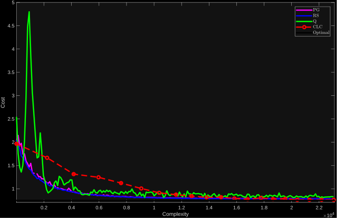
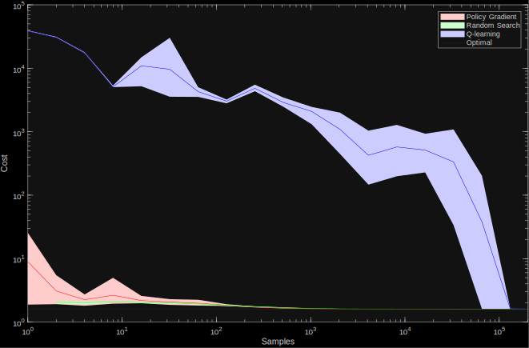

# Learning-LQR

A comprehensive, easy-to-use simulation environment to test reinforcement learning algorithms on linear systems with quadratic cost functions (LQR). The code can accommodate time-varying dynamics, and, in contrast to dlqr of matlab, can compute the optimal time-varying linear state feedback gain. Through the code one can evaluate and compare the policy gradient, random search, q-learning and our own-developed combined-learning-and-control (CLC) algorithm.

If you find this repository useful, please consider citing our [paper](https://arxiv.org/abs/2510.00308).

## What's included
We provide, ready-to-run examples that showcase the usage of this repository and that
- Reproduce the results of our [paper](https://arxiv.org/abs/2510.00308).
- Reproduce the 2D-vehicle experiment of [A Tour of Reinforcement Learning: The View from Continuous Control, by Benjamin Recht](https://doi.org/10.1146/annurev-control-053018-023825)

## Algorithms
- Optimal control. Find the optimal policy for the LQR problem through Dynamic Programming. Implementation follows faithfully [Optimal Control Theory: An Introduction, by Donald E. Kirk](https://dl.icdst.org/pdfs/files3/d0057acc9daf94f3e2b14d1498f2421b.pdf)
- Policy Gradient
- Random Search 
- Q-learning

